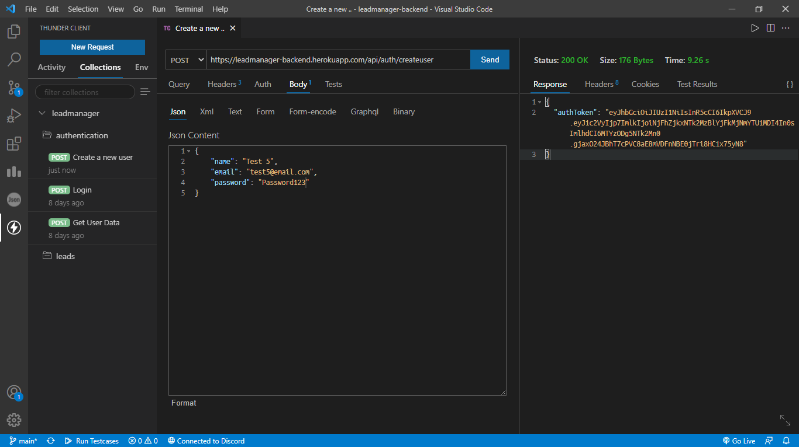
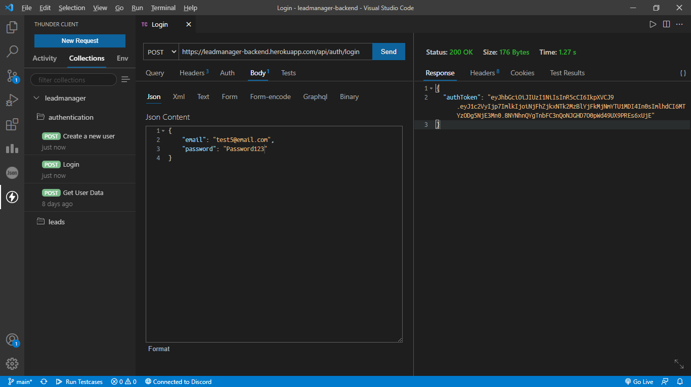
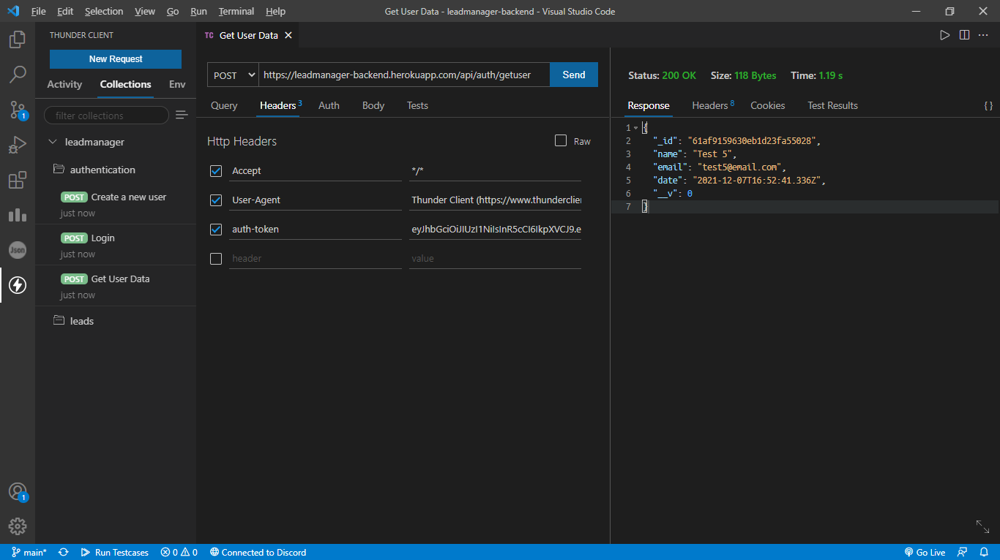
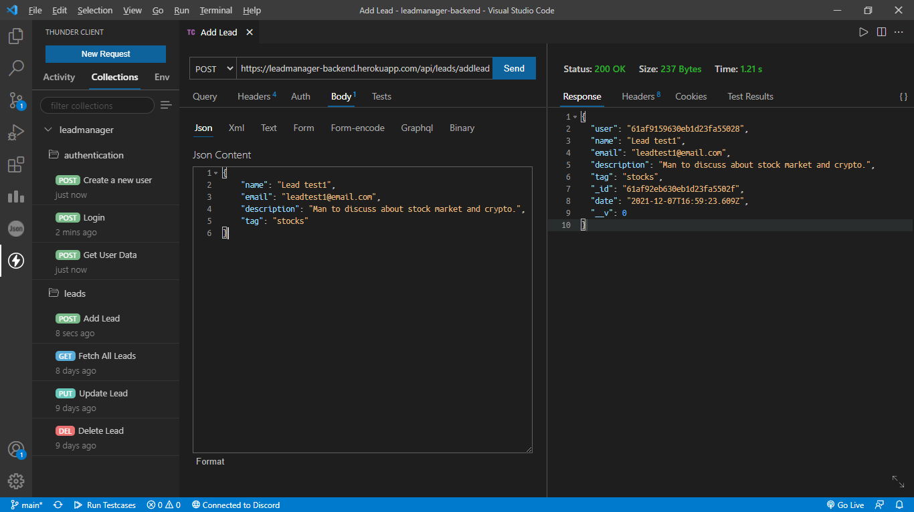
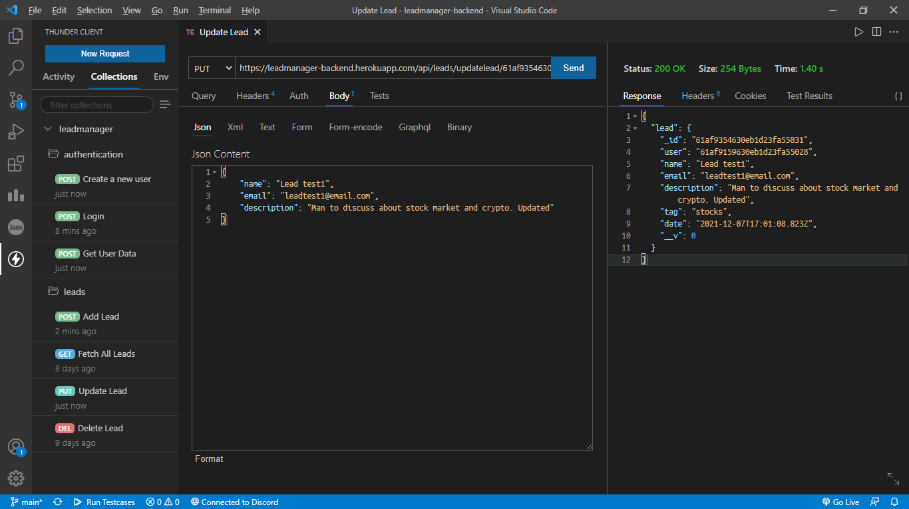
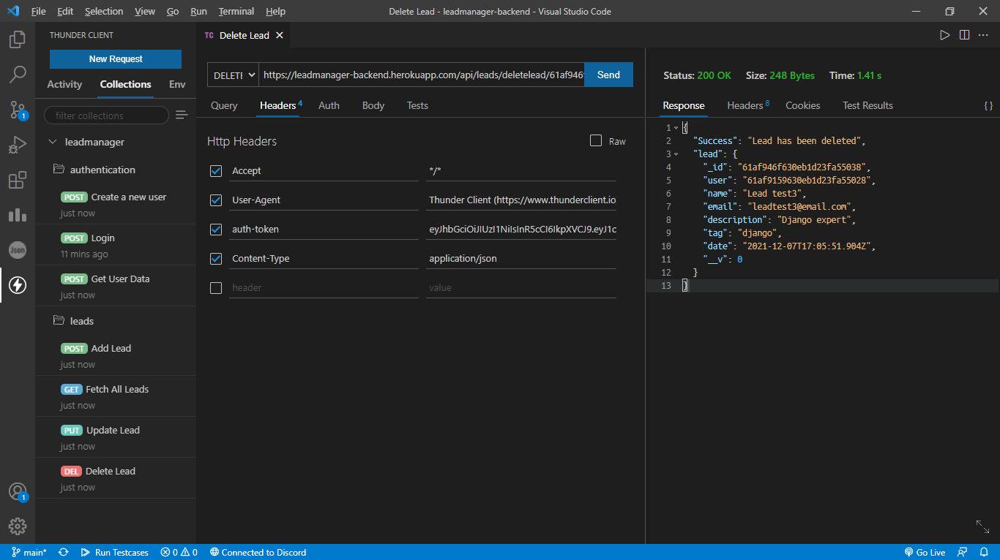

# 🌐 LEAD MANAGER BACKEND

Backend application for Lead Manager Webapp.

---

## :memo: Progress

- Built REST APIs.
- Tested APIs using Thunder Client.
- Used JSON web token for authentication.
- Integrated MongoDB Cloud Database.
- Used Salt & Pepper for hashing password to inhance security.
- Passwords are encrypted using BycryptJs.
- Backend application deployed on HEROKU.
- Frontend is in development phase.

---

## :bulb: Built Using

- [**EXPRESSJS**](https://expressjs.com/)
- [**NODEJS**](https://nodejs.org/en/)
- [**MONGODB**](https://www.mongodb.com/)
- [**THUNDER CLIENT**](https://www.thunderclient.io/)
- [**HEROKU**](https://dashboard.heroku.com/)

---

## :computer: Screenshots

Screenshots of API testing on Thuder Client and will be replaced with final product once project is completed.

Thunder Client Collection can be accessed [**here**](thunder-collection_leadmanager.json)

### SignUp

`Endpoint: https://leadmanager-backend.herokuapp.com/api/auth/createuser`

### SignIn
`Endpoint: https://leadmanager-backend.herokuapp.com/api/auth/login`

### User Profile

`Endpoint: https://leadmanager-backend.herokuapp.com/api/auth/getuser`

### Add Lead
`Endpoint: https://leadmanager-backend.herokuapp.com/api/leads/addlead`

### Update Lead
`Endpoint: https://leadmanager-backend.herokuapp.com/api/leads/updatelead/<lead_id>`

### Fetch All Leads
`Endpoint: https://leadmanager-backend.herokuapp.com/api/leads/fetchallleads`

### Delete Lead
`Endpoint: https://leadmanager-backend.herokuapp.com/api/leads/deletelead/<lead_id>`

---

## :man: Project Created & Maintained By

  Utkarsh Chaurasia

